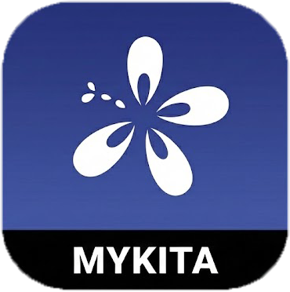

# MyGovHub

## Project Overview

**MyKITA** is a MyKad-centric immediate disaster response system designed to solve the critical problems of inaccessible online-only disaster relief and chaotic manual registration during emergencies.

Our solution framework features an offline-first architecture, local mesh networking, and the MyKad to ensure secure, barrier-free victim registration and operational efficiency at relief centers. The system also aims to deliver accurate, real-time data to officers for smarter logistics and decision-making. MyKita is not just an app, it’s a full-fledged ecosystem ready to recover an estimated **RM96 million to RM236 million yearly** in administrative and logistic inefficiencies by digitizing the process which in turn ensures public funds go directly to the victims who need them most.

## Problem Statement
1. Inaccessibility \
Online based solution is not accessible when disaster-stricken area has no connection.

2. Lack of Inclusivity \
Elderly and rural communities may lack the digital literacy to access and register themselves on a application-based solution.

3. Logistic Failure \
The lack of data-supported decision making would lead to logistics failure such as overcrowded relief centers and insufficient or unfair resource allocations. 

4. Legacy Disaster Relief Procedures \
Current victim management system still relies on manual registration and records.

## Solution Concept
1. Secured Accessibility \
Victims can register themselves in any PPS without the hustle of installing any applications or accessing online portals.

2. Operational Efficiency \
Victim management procedures at PPS centers are streamlined, allowing victims to settle down much quicker.

3. Data-Supported Decision Making \
Critical decision making such as victim status flagging and PPS center load monitoring is backed by trustworthy data sources.

## Solution Workflow
**Application of MyKad in Disaster Responses**

1. PPS Check In\
Victims scan MyKad to register themselves when reaching relief centers

2. Health Screening\
From medical records in MyKad, victims with health issues are flagged.

3. Real-Time PPS Tracking\
Real-time info-sharing (PPS capacity, victim status etc.) among officers across all affected areas.

4. Resource Allocation\
Automated supply needs updates based on victims’ profiles (age, gender, medical condition etc.)

## System Architecture

